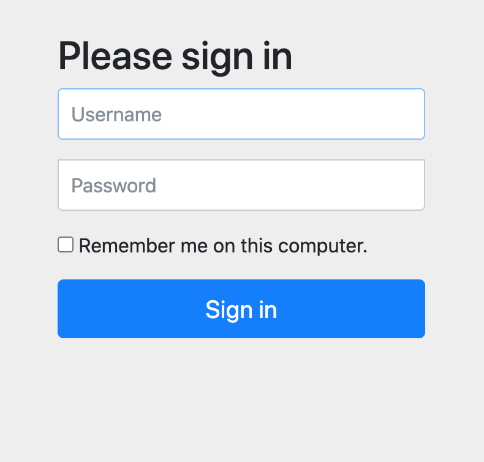
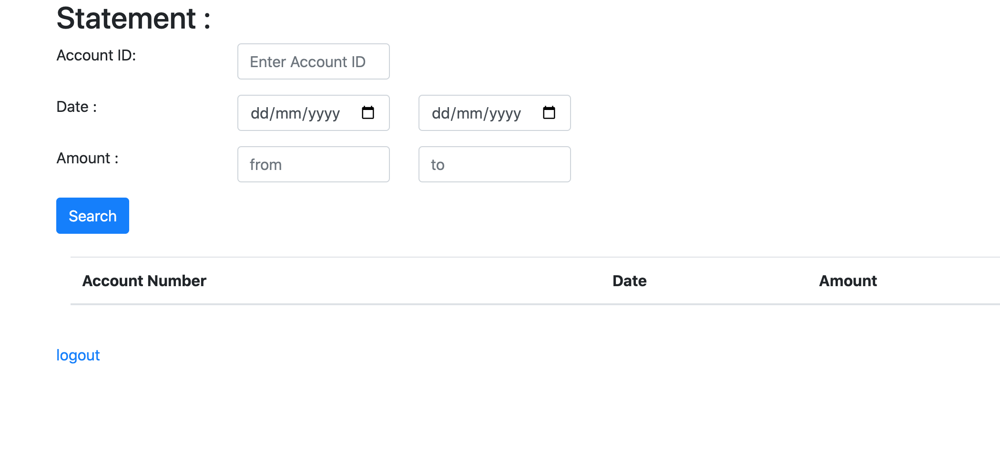
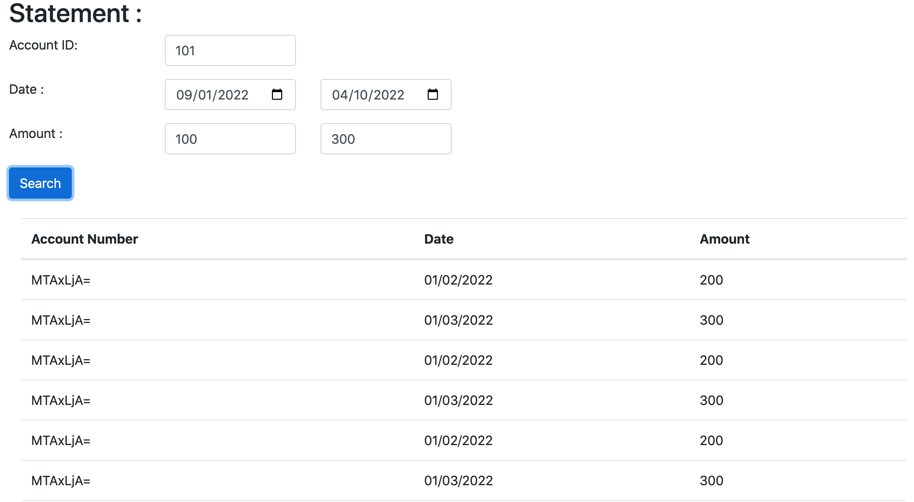

# **Application Build
``mvn clean install``

# **Application Deployment
``mvnw spring-boot:run``

## Open the App
``localhost:8080``


```
username: admin
password: admin
```

```
username: user
password: user
```
### Filter can be applied on the statment search



### Final result


